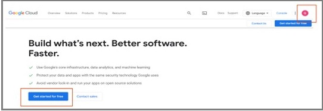
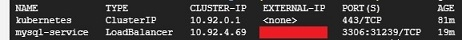

# Lab 3 Part 1: Deploying using Google Kubernetes Engine

After creating the web application, it has to be deployed. This web application will be containerized into a **Docker image**. Then, the container would be deployed over the **Google Cloud Platform (GCP)** using a container orchestrating tool (**Kubernetes**).

# Table of Contents

1. [Creating GCP account](#creating-gcp-account)
2. [Setting up Google Kubernetes Engine (GKE)](#setting-up-google-kubernetes-engine-gke)
3. [Deploy MySQL server on GKE](#deploy-mysql-server-on-gke)
4. [Deployment using YAML files (the easy way)](#deployment-using-yaml-files-the-easy-way)
5. [Deploy The Maven Project](deploy-the-maven-project)
6. [Discussion](#discussion)
7. [Design](#design)
8. [Deliverables](#deliverables)

## Objectives:
1. Get Familiar with Docker and Kubernetes.
2. Use Google Cloud Platform.
3. Deploy Maven WebApp over Google Kubernetes Engine (GKE).

## Repository:
[https://github.com/zubxxr/SOFE3980U-Lab3-Part1](https://github.com/zubxxr/SOFE3980U-Lab3-Part1)

Docker, Kubernetes and GKE
1.	Watch The following video to understand [Docker terminologies](https://youtu.be/rOTqprHv1YE).  
2.	To manage Docker images and applications, we will use Kubernetes; the following video explains [Kubernetes and its components](https://youtu.be/cC46cg5FFAM).

## Creating GCP account
1. Creating a new Gmail account is recommended, but you can use an existing one if it still allows you a free trial (**don't use the university's official email**).
2. Go to the [GCP official site](https://cloud.google.com/gcp). Be sure that you are using the correct account. Then, click on **Get Started for Free** button 

      

3. Fill the account information and accept the terms of service. 

      

4. In the next step, you will fill in your personal and credit card information. That information is to ensure that you are a real person. This will create a free account for 90 days and give you 300+ $ free credits. **No charges are made unless you upgrade to a paid Cloud Billing account**. Please read [the GCP billing verification](https://cloud.google.com/free/docs/free-cloud-features#billing_verification) for more information.  

      

5.	Fill in the final survey. Then, click **Done**. You can safely skip any given offers.  

      

6.	Get yourself familiar with
   * **the Dashboard**: allows you to search and select available cloud services
   * **project(s)**: a project usually named **My First Project** will be created by default. You can create, edit, and delete projects.
   * **the console**: By clicking the console icon, the console open for you. The console is a Linux terminal that can be used to configure the cloud. Any commands affecting the console's local OS will be temporary and lost whenever the session is closed, while any change made to cloud services will be permanent.
     
          
      
        The console will be opened at the bottom of the page, as shown in the following figure, and from it, files and folders can be exchanged with your local computer by downloading or uploading them. You can also click the **Open Editor** button to open the editor.
      
          

   * **the editor**: It’s a text editor that allows you to edit plain text files, as shown in the following figure. You can switch back to the console by clicking the **Open Terminal** button. 

          
      
## Setting up Google Kubernetes Engine (GKE)
To set up Google Kubernetes Engine (**GKE**), open the console of the project you have created within the Google Cloud Platform (GCP) during the first milestone.
1. Set the default compute zone to **northamerica-northeast1-b**
   
   ```cmd
   gcloud config set compute/zone northamerica-northeast1-b  
   ```
    
2. Enable GKE by searching for **Kubernetes Engine**. Select **Kubernetes Engine API**. Then, click **Enable**.
   
   
   
3. Wait until the API is enabled. Then, create a three-node cluster on GKE called **sofe3980u**. A Node is a worker machine in which docker images and applications can be deployed.
   
   ```cmd
   gcloud container clusters create sofe3980u --num-nodes=3 
   ```
      
   **Note**: if the authorization windows pop up, click Authorize
   
   **Note**: if you get an error that there are no available resources to create the nodes, you may need to change the default compute zone (e.g., to **us-central1-a**) or reduce the number of nodes.

## Deploy MySQL server on GKE
We will deploy a pre-existing MySQL image as an example of a Docker image.
1. Through the console of your GCP project, execute the following command to pull the MySQL image and deploy it over a pod in GKE.
   ```cmd
   kubectl create deployment mysql-deployment --image mysql/mysql-server --port=3306 
   ```
   Deployment's role is to orchestrate docker applications. It would pull the **mysql/mysql-server** Docker image and deploy and enable the **3306** port number to allow access from the outside world. **mysql-deployment** is the name that Kubernetes will use to access this deployment. Only one pod (replica) will be created per deployment by default.
2. The following command checks the status of the deployment 
   ```cmd
   kubectl get deployments 
   ```
   A tip to make it easier is to add the **--watch** argument to the command. You can use this argument for the commands below as well, such as get pods, get service, etc. And if you would like to terminate the command, just press **CTRL+C**.
  
   ```cmd 
   kubectl get deployment --watch
   ```

3. While the following command accesses the status of the pod 
   ```cmd
   kubectl get pods 
   ```
   Check that the deployment is available and that the pod is running successfully (it may take some time until everything is settled down) 
4. To access the MySQL logs,
   1. According to the [image documentation](https://dev.mysql.com/doc/refman/8.0/en/linux-installation-docker.html), the root password will be generated randomly because we didn't specify it during pod creation. To get that password, we access the logs generated locally by the pod and search them for the line containing the randomly generated password. This can be achieved using the following command after replacing **\<pod-name\>** with the pod name obtained by the previous step.
      ```cmd
      kubectl logs <pod-name> |grep GENERATED 
      ```
      Also, accessing the logs of a pod helps a lot in troubleshooting it in case of an error or a crash. 
   2. You  can  access  the  database  by  running  the  command  **mysql**  within  the  pod,  by  using  the following command 
      ``` cmd
      kubectl exec -it  <pod-name>  -- mysql -uroot -p 
      ```
      Kubernetes exec command allows you to execute a particular command within a specific pod in interactive (-i option) and by using the Linux terminal (-t option). The command we want to execute is mysql which opens a CLI to the MySQL database. It has two options: **-u** followed by the username, i.e., root, and **-p** followed by the root password you got. **Note** that there is no whitespace between the **-u** and **root**.
      **Note**: for security reasons, the password remains invisible while you type or paste it.
   4. After successful login to the MySQL server, it's recommended to change the root password using the following MySQL command (don't forget to replace **\<new-password\>** with a password of your choice). 
      ```sql
      ALTER USER 'root'@'localhost' IDENTIFIED BY '<new-password>' ; 
      ```
   5. Then you can run any MySQL command, like 
      ``` cmd
      show databases; 
      ```
      to display all available schemas.
   6. To exit drom the MySQL CLI, execute 
      ```sql
      exit 
      ```
   7. To login again to the CLI, use the new password after the **-p** option in the mysql command
      ```cmd
      kubectl exec -it  <pod-name>  -- mysql -uroot -p<root-password> 
      ```
      Again, there are no whitespaces between -p and the password
   8. To create a new user, called **user** with a password **sofe3980u**, and give all permissions to the user, use the following MySQL command 
      ```cmd
      CREATE USER 'user'@'%' IDENTIFIED BY 'sofe3980u'; 
      GRANT ALL PRIVILEGES ON *.* TO 'user'@'%' WITH GRANT OPTION; 
      ```
   9. Exit from the MySQL CLI.
5. To associate the deployment with an IP address,
   1. A load Balancer service, **mysql-service**, should be created for that deployment. The load Balancer distributes the requests and workload between the replicas in the deployment (why this is not important in our case?) and associates an IP to access the deployed application.
      ```cmd
      kubectl expose deployment mysql-deployment --type=LoadBalancer --name=mysql-service 
      ```
      
      You can add two options: **--port** specifying the service port number and **--target-port** specifying the pod port number. If not specifies, both will be the same as the port numbers already exposed via the deployment command. 
   2. To check the status of the service, use the following command
      ``` cmd
      kubectl get service 
      ```
      It may take some time until the external IP address is changed from pending to a valid IP address. You may need to repeat the previous command or add the **--watch** flag until the IP becomes available.
      
            

   3. Once you get a valid external IP address, you can use it to connect to the deployed MySQL server from any machine. For example, to connect to it from the GCP console, run the following command after replacing **\<IP-address\>** with the obtained IP.
      ```cmd
      mysql -uuser -psofe3980u -h<IP-address> 
      ```
      
   4.  exit from the MySQL CLI.
      
7. To delete the deployment and the service
   ```cmd
   kubectl delete deployment mysql-deployment 
   kubectl delete service mysql-service 
   ```
   
## Deployment using YAML files (the easy way)
In this section, the MySQL image will be deployed over the GKE cluster using YAML files. A YAML file contains the configuration used to set the deployment and the service.
1. Clone the GitHub repository
   ```cmd 
   cd ~
   git clone https://github.com/zubxxr/SOFE3980U-Lab3-Part1
   ```
2. Run the following command to deploy the MySQL server 
   ```cmd 
   cd ~/SOFE3980U-Lab3-Part1/MySQL
   kubectl create -f mysql-deploy.yaml
   ```
   The command will deploy the template stored in the **mysql-deploy.yaml** into GKE. The file is shown in the following figure and can be interpreted as:
   * **Indentation** means nested elements
   *	**Hyphen** means an element within a list
   *	**First two lines**: indicate the type of the YAML configuration and its version.
   *	**Line 4**: provides a name for the deployment.
   *	**Line 6**: indicates that only a single pod will be used
   *	**Line 9**: provides the name of the application that the pod accesses.
   *	**Line 16**: provides the ID of the Docker image to be deployed
   *	**Lines 19-24**: define image-dependent environment variables that define username/password (**user/sofe3980u**) and a schema (**Readings**).
   *	**Line 26**: defines the port number that the image uses.
      
       

   You can refer to the documentation of the **mysql/mysql-server** Docker image for the list of all supported environment variables (like those in lines 19:26) and their usage.
3. The following command checks the status of the deployment
   ```cmd 
   kubectl get deployment 
   ```
4. The following command prints the status of pods
   ```cmd 
   kubectl get pods  
   ```
   Check the deployment's availability and the pod's successful running (it may take some time until everything is settled down).
   
6. To associate an IP to the deployment
   1. A load Balancer service should be created using the mysql-service.yaml file from the cloned GitHub
      ```cmd 
      cd ~/SOFE3980U-Lab3-Part1/MySQL
      kubectl create -f mysql-service.yaml
      ```
      The important lines in the mysql-service.yaml file are:
      * **Line 8**: the port number that will be assigned to the external IP.
      * **Line 10**:  the name of the application the service targets.
      
               
   
   2. To print the status of the service, use this command 
      ```cmd 
      kubectl get service 
      ```
            
      
      It may take some time until the external IP address is changed from pending to a valid IP address. You may need to repeat the previous command.
7. To access the MySQL server using the IP address,
   1. Run the following commands from the GCP console (or any other device on which the MySQL client is installed). Before running the command, replace the **\<IP-address\>** with the external IP obtained in the previous step. The options **-u**, **-p**, and **-h** specify the deployed server's **username**, **password**, and **host IP**, respectively.
      
      ```cmd
      mysql -uuser -psofe3980u -h<IP-address>
      ```
      
   2. Try to run the following SQL statements 
      ```sql
      use Readings; 
      create table meterType( ID int, type varchar(50), cost float); 
      insert into meterType values(1,'boston',100.5); 
      insert into meterType values(2,'denver',120); 
      insert into meterType values(3,'losang',155); 
      select * from meterType where cost>=110; 
      ```
   4. Exit the MySQL CLI, by running
      ```sql
      exit
      ```
   
   5. To delete the deployment and the service, use the following command 
       ```cmd
      cd ~/SOFE3980U-Lab3-Part1/MySQL
      kubectl delete -f mysql-deploy.yaml
      kubectl delete -f mysql-service.yaml
      ```  
## Deploy The Maven Project
 new Docker image will be created in this section based on a previous version of the Maven project created at the second milestone, **BinaryCalculatorWebapp**, which will be converted into a Docker image. GKE will be used to Deploy it.
1. From the GCP console, change the current directory to the path **/BinaryCalculatorWebapp** at the cloned repository. Then, build the application to generate the WAR file. 
   ```cmd
   cd ~/SOFE3980U-Lab3-Part1/BinaryCalculatorWebapp
   mvn package
   ```
2. The path also contains another file, **Dockerfile**. It contains the steps necessary to create the docker image. The steps can be summarized as:
   * line 1: starting with a base image.
   * line 2: create a volume **tmp** used by the TomCat server for temporary files.
   * line 3: copy the war file(s) from the path ./target at the host machine to the working directory at the docker image.
   * line 4: run the web application
   
               
      
3. the generated Docker image has to be stored globally. Thus, a Docker repo will be created in the GCP project.
   * Search for **Artifact Registry**
     
              
   
   * In the **repositories** tab, press the **+** button to create a new repo.

     
     
   * Name it **sofe3980u** and ensure that the type is set to **Docker**. Set the region to "northamerica-northeast2 (Toronto)". Finally, press **create**.

     
     
   * open the **sofe3980u** repository and  copy the repository path.

     

4. To create a docker image using the **Dockerfile**, run the following command after replacing **\<repo-path\>** with the repository path you already copied in the previous step.
   ```cmd
   docker build -t <repo-path>/binarycalculator .
   ```
   
5. To use the image globally, it should be pushed into the **sofe3980u** repository in the **Artifact registry**.
      ```cmd
      docker push <repo-path>/binarycalculator
      ```
      
6. To deploy the image using GKE
   ```cmd
   kubectl create deployment binarycalculator-deployment --image <repo-path>/binarycalculator --port=8080 
   ```

7. To assign an IP to the deployment
   ```cmd
   kubectl expose deployment binarycalculator-deployment --type=LoadBalancer --name=binarycalculator-service 
   ```
   
8. Get the IP associated with the service and access the application with that IP at port 8080 using the **http** protocol.

## Discussion:
1. Briefly summarize what you have learned about docker and Kubernetes, including their terminologies and descriptions.
2. What are the advantages and disadvantages of using docker images?

## Design:
* Update the Binary Calculator Application using the last version you implemented in the previous milestone
* Delete both the running deployment and service. Write YAML file(s) to replace them. Then, redeploy them using the YAML file(s).

## Deliverables:

1. A report that includes
   * The discussion part.
   * GitHub link with your Binary Calculator Application and the YAML files.
   * Video Links
   * Instructions you used to create and deploy your application.
2. An audible video of about 5 minutes showing the MySQL deploying (the two techniques).  
3. An audible video of about 3 minutes showing the deploying and executing of the Binary Calculator Application.
   - Make sure to show the IP of your application in the terminal and the launching of the IP URL in the browser.

**Note**: Delete the running deployments and services after you have submitted to avoid consuming credits.
